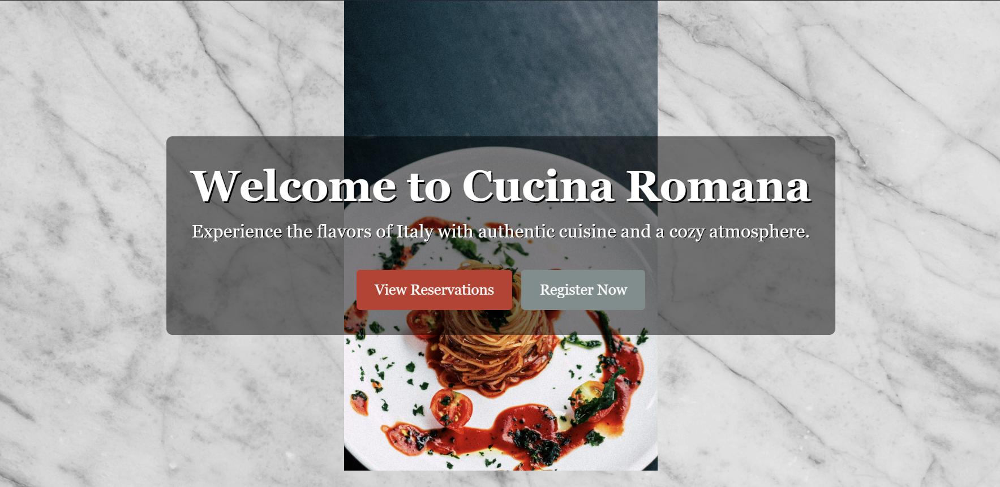
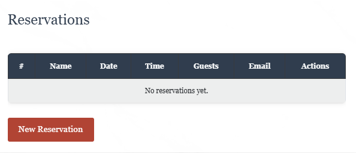
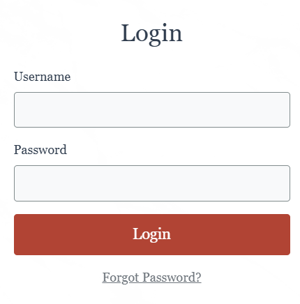

# Restaurant Booking System

**Restaurant Booking System** is a web application designed to streamline restaurant reservation processes and menu management. This project serves as a comprehensive platform for both diners and restaurant administrators, enabling efficient table reservations and menu updates.

Explore the live application at: [Deployed Site](https://restaurant-booking-system123-2102e902d1fa.herokuapp.com/).

---

## Table of Contents

1. [Project Overview](#project-overview)
2. [Features](#features)
3. [Technologies Used](#technologies-used)
    - [Languages Used](#languages-used)
    - [Python Modules Imported](#python-modules-imported)
4. [Testing](#testing)
    - [Lighthouse](#lighthouse)
    - [Code Validation](#code-validation)
    - [Unit Test - Automated](#unit-test---automated)
    - [Browser Testing](#browser-testing)
    - [Device Testing](#device-testing)
    - [Manual Testing](#manual-testing)
5. [Bugs](#bugs)
    - [Fixed Bugs](#fixed-bugs)
6. [Deployment](#deployment)
    - [Pre-Deployment Checklist](#pre-deployment-checklist)
    - [Deploying on Heroku](#deploying-on-heroku)
    - [Forking the Repository](#forking-the-repository)
    - [Cloning the Repository](#cloning-the-repository)
    - [Running the Repository Locally](#running-the-repository-locally)
7. [References](#references)
8. [Credits](#credits)
9. [Acknowledgements](#acknowledgements)

---

## Project Overview

The **Restaurant Booking System** aims to provide a user-friendly experience for restaurant patrons to book tables and administrators to manage operations. The platform includes tools to:
- Facilitate secure account management.
- Enable efficient table reservations.
- Streamline dynamic menu management.

---

## Features

### User Features:
- **Account Registration and Login**: Users can register using Django's built-in `UserCreationForm`, allowing secure management of credentials.
#### Press Register 

#### Fill in the form 

#### Login

#### Logout

- **Reservation Management**: Book a table, view existing reservations, and make updates or cancellations.
#### Reservation

#### Fill in the form

#### Current reservations

#### Deleted reservations

## Admin Features:
- **Implemented across reservations and menu management.**: Implemented across reservations and menu management.

---

## Technologies Used

### Languages Used:
- **HTML**
- **CSS**
- **JavaScript**
- **Python**

### Python Modules Imported:
- Django
- Gunicorn
- Psycopg2
- Cloudinary

---

## Testing

### Lighthouse:
Lighthouse audits were performed to ensure high performance, accessibility, and SEO scores.

### Code Validation:
- **HTML and CSS Validation**: Verified using W3C Validators.
- **Python Validation**: Confirmed adherence to PEP8 standards.

### Manual Testing:
- Tested all features across browsers (Chrome, Firefox, Edge) and devices (mobile, tablet, desktop).
- Verified CRUD functionality for reservations and menu items.

### Unit Tests:
- Used Django’s `TestCase` for automated testing of models, views, and forms.

---

## Bugs

### Fixed Bugs:
1. Resolved issues with placeholder text not displaying on forms.
2. Corrected improper `aria-label` assignments for accessibility compliance.
3. Fixed a bug preventing static files from loading in production.

---

## Deployment

### Pre-Deployment Checklist:
1. Update `requirements.txt` using `pip freeze > requirements.txt`.
2. Add a `Procfile` to define the application’s runtime environment.
3. Configure environment variables:
   - `SECRET_KEY`
   - `DATABASE_URL`
   - `CLOUDINARY_URL`

### Deploying on Heroku:
1. Create a Heroku account and set up a new app.
2. Link your GitHub repository and enable automatic deploys.
3. Add necessary configuration variables in the Heroku dashboard.
4. Deploy the app and test live functionality.

---

## Screenshots

### Home Page

### Menu

### Reservation Form

### Login

## References

- **Django Documentation**: [https://docs.djangoproject.com/](https://docs.djangoproject.com/)
- **Bootstrap Documentation**: [https://getbootstrap.com/](https://getbootstrap.com/)
- **Stack Overflow**: Adapted logic for form handling and error validation.

---

## Credits

### Content:
- Content and functionality ideas inspired by real-world restaurant reservation systems.

### Media:
- Images sourced from [Unsplash](https://unsplash.com).

### Code:
- UI styling was implemented using [Bootstrap](https://getbootstrap.com).
- Form handling and validation leveraged examples from Django's official documentation.

---

## Acknowledgements

- Thanks to the Django community for extensive documentation and support forums.
- Special appreciation to the Bootstrap team for their flexible UI components.
- Gratitude to online resources like Stack Overflow for solving complex bugs.

---

This README provides a structured overview of the **Restaurant Booking System**, ensuring clarity and accessibility for collaborators and end-users.

