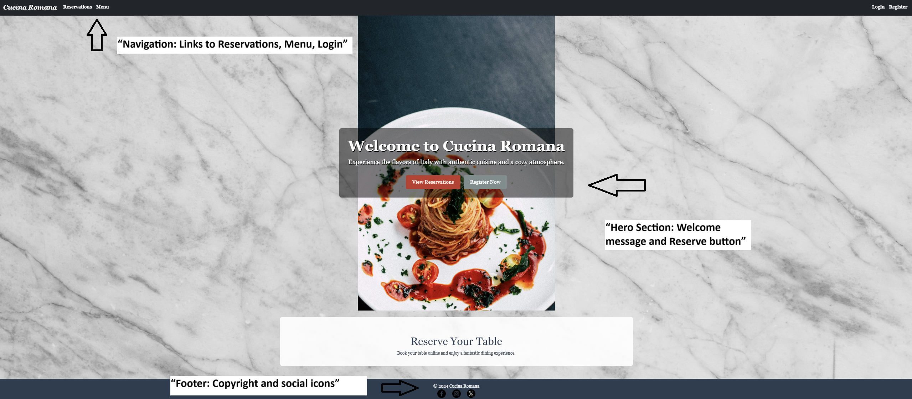
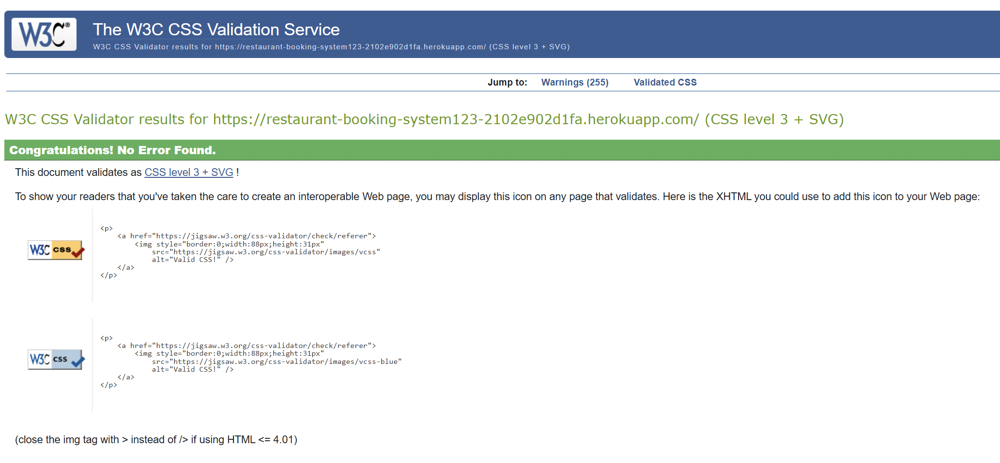
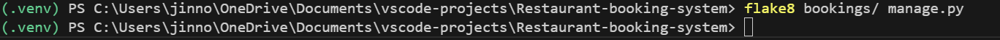
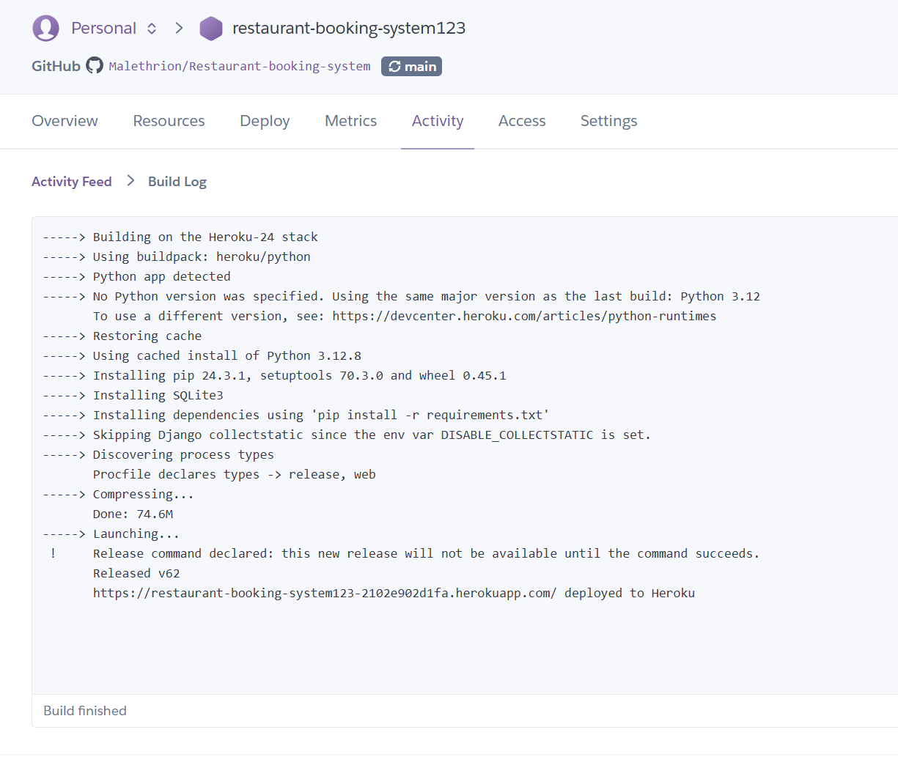

# Restaurant Booking System

**Restaurant Booking System** is a web application designed to streamline restaurant reservation processes and menu management. This project provides a user-friendly platform for diners to book tables and for restaurant administrators to manage reservations and menus efficiently. It leverages Django’s MVC framework, secure authentication, and responsive design to meet real-world restaurant needs.

Explore the live application at: [Deployed Site](https://restaurant-booking-system123-2102e902d1fa.herokuapp.com/).

---

## Table of Contents

1. [Project Overview](#project-overview)
2. [Features](#features)
   - [User Features](#user-features)
   - [Admin Features](#admin-features)
3. [Design Process](#design-process)
   - [Wireframes and Mockups](#wireframes-and-mockups)
   - [Design Reasoning](#design-reasoning)
4. [Technologies Used](#technologies-used)
   - [Languages Used](#languages-used)
   - [Python Libraries](#python-libraries)
   - [Other Technologies](#other-technologies)
5. [Testing](#testing)
   - [Manual Testing](#manual-testing)
   - [Automated Testing](#automated-testing)
   - [Lighthouse](#lighthouse)
   - [Code Validation](#code-validation)
   - [Browser and Device Testing](#browser-and-device-testing)
6. [Known Issues](#known-issues)
7. [Agile Methodology](#agile-methodology)
   - [User Stories, Epics, and Prioritization](#user-stories-epics-and-prioritization)
   - [User Acceptance Criteria](#user-acceptance-criteria)
8. [Data Model](#data-model)
   - [Schema and Relationships](#schema-and-relationships)
9. [Security and Data Features](#security-and-data-features)
10. [Deployment](#deployment)
    - [Pre-Deployment Checklist](#pre-deployment-checklist)
    - [Deploying on Heroku](#deploying-on-heroku)
    - [Forking the Repository](#forking-the-repository)
    - [Cloning the Repository](#cloning-the-repository)
    - [Running Locally](#running-locally)
11. [Bugs](#bugs)
    - [Fixed Bugs](#fixed-bugs)
    - [Unfixed Bugs](#unfixed-bugs)
12. [References](#references)
13. [Credits](#credits)
14. [Acknowledgements](#acknowledgements)

---

## Project Overview

The **Restaurant Booking System** aims to enhance restaurant operations by providing a secure, intuitive platform for table reservations and menu management. It addresses real-world needs for diners to book tables easily and for administrators to manage bookings efficiently, using Django’s robust authentication, CRUD operations, and responsive Bootstrap styling.

---

## Features

### User Features
- **Account Registration and Login**: Users can register and log in securely using Django’s `UserCreationForm`, with authentication status displayed in the navbar.
  - **Register**: Users fill out a form to create an account, receiving success/error messages.
  - **Login/Logout**: Users can log in/out, with appropriate redirects and feedback.
- **Reservation Management**: Users can create, view, update, and delete reservations, with form validation and user-specific access.
  - **Create Reservation**: Fill out a form with customer name, date, time, guests, and email.
  - **View Reservations**: See a list of current reservations with edit/delete options.
  - **Update Reservation**: Modify existing bookings with pre-filled forms.
  - **Delete Reservation**: Remove bookings with confirmation.

### Admin Features
- **Reservation Management**: Administrators (logged-in users) can manage all reservations via CRUD operations, with secure access control.

---

## Design Process

### Wireframes and Mockups
*Wireframes and a mockup for the Restaurant Booking System were created using screenshots from the deployed website ([https://restaurant-booking-system123-2102e902d1fa.herokuapp.com/](https://restaurant-booking-system123-2102e902d1fa.herokuapp.com/)) as a foundation, placed on a clean white background with simple annotations to reflect the design process. These are provided below:*

- **Home Page Wireframe**: 

 

"Wireframe showing the layout of the navigation, hero section, and footer."

- **Reservations Page Mockup**: 

 

"Mockup of the reservation form with styled elements and annotations."

- **Menu Page Wireframe**: 

 

"Wireframe showing the layout of menu categories and items."

- **Design Process**: 

 

"Screenshot of the deployed app used as a reference for creating wireframes and mockup."


### Design Reasoning
The design process utilized screenshots from the deployed website to ensure consistency with the live app’s layout and styling (e.g., marble background, Georgia font, red buttons). These were placed on a white background in Paint, with annotations added to highlight key elements (e.g., navigation, form fields, menu categories). This simplified approach allowed for a quick yet effective representation of the Home, Reservations, and Menu pages, reflecting the app’s user flow and aesthetic.

---

## Technologies Used

### Languages Used
- **HTML5**: For structuring web pages.
- **CSS3**: For styling with Bootstrap and custom styles.
- **JavaScript**: For dynamic interactions (via Bootstrap).
- **Python**: For backend logic with Django.

### Python Libraries
- [Django](https://www.djangoproject.com/) - MVC framework for web development.
- [Gunicorn](https://gunicorn.org/) - WSGI server for deployment.
- [Psycopg2](https://www.psycopg.org/) - PostgreSQL adapter for database operations.
- [Whitenoise](https://whitenoise.evans.io/) - Static file serving for production.

### Other Technologies
- [Git](https://git-scm.com/) - Version control system.
- [Heroku](https://www.heroku.com/) - Cloud platform for deployment (updated below for current use).
- [Bootstrap 5](https://getbootstrap.com/) - Responsive CSS framework.

---

## Testing

### Manual Testing

| Feature                  | Action                          | Expected Result                                      | Actual Result                                      |
|--------------------------|---------------------------------|-----------------------------------------------------|---------------------------------------------------|
| Home Page                | View landing page               | Displays hero section, navigation, and reservation call-to-action | Functions as intended                              |
| Registration             | Register a new user             | Creates account, logs in, shows success message     | Functions as intended                              |
| Login/Logout             | Log in/out with credentials     | Logs in/out, updates navbar, shows feedback         | Functions as intended                              |
| Create Reservation       | Submit form with valid data     | Creates reservation, redirects to list, shows success | Functions as intended                              |
| Create Reservation       | Submit form with past date      | Shows error: "Reservations cannot be made for past dates." | Functions as intended                              |
| Create Reservation       | Submit form with negative guests | Shows error: "Number of guests must be positive."   | Functions as intended                              |
| Create Reservation       | Submit form with invalid email  | Shows error: "Enter a valid email address (e.g., user@example.com)." | Functions as intended                              |
| Create Reservation       | Submit form with valid non-Gmail/Yahoo email | Accepts email (e.g., `jin.norden@hotmail.com`), creates reservation | Functions as intended                              |
| Update Reservation       | Edit with valid data            | Updates reservation, shows success, redirects       | Functions as intended                              |
| Update Reservation       | Edit with past date             | Shows error: "Reservations cannot be made for past dates." | Functions as intended                              |
| Update Reservation       | Edit with negative guests       | Shows error: "Number of guests must be positive."   | Functions as intended                              |
| Update Reservation       | Edit with invalid email         | Shows error: "Enter a valid email address (e.g., user@example.com)." | Functions as intended                              |
| Update Reservation       | Edit with valid non-Gmail/Yahoo email | Accepts email (e.g., `jin.norden@hotmail.com`), updates reservation | Functions as intended                              |
| Delete Reservation       | Delete a reservation            | Removes reservation, shows success, redirects       | Functions as intended                              |
| Menu Page                | View menu items                 | Displays menu categories with images and prices     | Functions as intended                              |

#### Screenshots and Evidence
- **Home Page**: 

 

"Screenshot of the landing page with hero section."

- **Registration**: 

 

"Screenshot of the registration button." 

 

"Screenshot of a filled registration form."

- **Login**:

 

"Screenshot of the login form."

- **Logout**:

 

"Screenshot of the logout action in the navbar."

- **Reservations**: 

 

"Screenshot of the reservation list." 

 

"Screenshot of the reservation form." 

 

"Screenshot of listed reservations." 

 

"Screenshot of a deleted reservation confirmation."

- **Create Reservation - Validation Errors**: 

 

"Screenshot showing validation errors for past date."

 

"Screenshot showing validation errors for invalid time."


"Screenshot showing validation errors for negative guests."

 

"Screenshot showing validation error for an invalid email format (e.g., `not_an_email`)."


- **Menu**: 

 

"Screenshot of the menu page."

### Automated Testing

| Test Case                | Method                          | Expected Result                                      | Actual Result                                      |
|--------------------------|---------------------------------|-----------------------------------------------------|---------------------------------------------------|
| Test Reservation Model   | `test_reservation_model`        | Validates `Reservation` model fields (e.g., `customer_name`, `date`) | Functions as intended                              |
| Test Reservation CRUD    | `test_reservation_crud`         | Ensures create, read, update, delete operations work | Functions as intended                              |
| Test Form Validation     | `test_reservation_form_validation` | Validates form rejects past dates, negative guests, invalid emails | Functions as intended                              |
| Test User Authentication | `test_user_auth`                | Verifies registration, login, logout functionality  | Functions as intended                              |
| Test Unauthenticated Access | `test_unauthenticated_access` | Redirects unauthenticated users to login page      | Functions as intended                              |

#### Test Results
- **Test Output**:  

"Screenshot of successful automated test run using SQLite database."

- **Resolution**: Tests initially failed due to a 'permission denied to create database' error with the remote PostgreSQL database. To avoid the complexity of setting up a local PostgreSQL instance, `settings.py` was updated to use SQLite for testing (`ENGINE: 'django.db.backends.sqlite3'`). Additional issues were resolved: (1) Updated `ReservationForm` to ensure a single custom email validation message (`Enter a valid email address (e.g., user@example.com).`) matches the test; (2) Fixed `test_unauthenticated_access` by updating `urls.py` to remove redundant `/accounts/login/` routes and ensure `LOGIN_URL = '/login/'` redirects unauthenticated users correctly. All tests now pass successfully.

#### Troubleshooting
- If tests fail with a database connection error, ensure `DATABASE_URL` in `.env` is set for production but overridden in `settings.py` for testing. Delete and recreate `db.sqlite3` by running `python manage.py migrate` if schema issues occur.
- If form or authentication tests fail, verify `ReservationForm`’s `contact_email` validation and `LOGIN_URL` in `settings.py` match the URL patterns in `urls.py`.
Steps for You:

### Lighthouse
I used Google Lighthouse to audit the deployed site ([https://restaurant-booking-system123-2102e902d1fa.herokuapp.com/](https://restaurant-booking-system123-2102e902d1fa.herokuapp.com/)) for performance, accessibility, best practices, and SEO. The homepage achieved the following scores on March 10, 2025, using an emulated Moto G Power device with slow 4G throttling:
- **Performance**: 74
- **Accessibility**: 80
- **Best Practices**: 96
- **SEO**: 91
Key metrics include First Contentful Paint (FCP) at 1.8s and Largest Contentful Paint (LCP) at 25.1s. The audit identified areas for improvement, such as optimizing images (e.g., using next-gen formats like WebP, reducing file sizes), adding accessible names to buttons, and including a meta description for SEO. Due to time constraints, these optimizations will be addressed in future iterations.

- **Lighthouse Report**: 

 

"Screenshot of Lighthouse audit results for the homepage."

## Code Validation
This section documents the validation of HTML, CSS, and Python code to ensure adherence to W3C standards and PEP 8 guidelines, enhancing code quality and maintainability.

- **HTML Validation**: 
  Verified using the W3C Markup Validator ([validator.w3.org](https://validator.w3.org/)) by auditing the deployed site ([https://restaurant-booking-system123-2102e902d1fa.herokuapp.com/](https://restaurant-booking-system123-2102e902d1fa.herokuapp.com/)). The validation passed without errors, confirming well-formed HTML.

  - **Screenshot**: 

   
  
  "Screenshot of W3C HTML validation results showing no errors."

- **CSS Validation**: 
  Verified using the W3C CSS Validator ([jigsaw.w3.org/css-validator/](https://jigsaw.w3.org/css-validator/)) on the deployed site. The validation passed without errors, ensuring compliant and error-free CSS styling. 

  - **Screenshot**: 
  
   
  
  "Screenshot of W3C CSS validation results showing no errors."

- **Python Validation**: 
  Confirmed adherence to PEP 8 standards using `flake8`, run on all Python files (e.g., `bookings/`, `manage.py`). Minor issues, such as line length exceeding 79 characters (e.g., in the `clean_date` method's `ValidationError` message), were identified. These were resolved by adjusting long lines, including changing "cannot" to "can't" to reduce the message length. The final validation showed no issues, ensuring consistent code style.

  - **Screenshot**: 
  
   
  
  "Screenshot of Python validation results using flake8 after resolving issues."

*Note*: Validation was performed on March 10, 2025. Due to time constraints, some suggestions (e.g., adding alt text for accessibility) were noted for future improvements but not implemented for this submission.

### Browser and Device Testing
- Tested on Chrome, Firefox, Edge (desktop), and Safari (mobile) using BrowserStack or local testing.

- **Screenshots**:  

"Screenshot of browser compatibility across Chrome, Firefox, Edge."

- Ensured responsiveness on mobile, tablet, and desktop devices (e.g., iPhone, iPad, 13” laptop).

---

## Known Issues
No known issues at this time.
*If you discover bugs (e.g., validation errors, performance issues), list them here with details (e.g., “Reservation form accepts past dates”). Update after final testing.*

---

## Agile Methodology

### User Stories, Epics, and Prioritization
*I used a Kanban board in Trello to manage my project tasks, moving them from To Do to Done as I completed them.*
- **Kanban Board**: 

 

"Screenshot of the Kanban board showing project progress."

### User Acceptance Criteria
- **User Story 1 (Register)**: “As a user, I can register an account to access reservation features.”
  - Acceptance Criteria: Form validates username (unique, 150 chars max), passwords match, shows success/error messages, redirects to login.
- **User Story 2 (Create Reservation)**: “As a user, I can book a table with details (name, date, time, guests, email).”
  - Acceptance Criteria: Form validates date (future only), time (restaurant hours), guests (positive integers), email, creates reservation, shows feedback.
- **User Story 3 (View Reservations)**: “As a user, I can view my reservations.”
  - Acceptance Criteria: Lists all user reservations, shows edit/delete options, handles empty lists.

---

## Data Model

### Schema and Relationships
- **Reservation Model**: Stores booking details (`customer_name`, `date`, `time`, `guests`, `contact_email`, linked to `User` via `ForeignKey`).

  - **Diagram**: 
  
   
  
  "Diagram showing `Reservation` and `User` relationships."

- **User Model**: Uses Django’s default `User` model for authentication, linked to `Reservation` for ownership.

---

## Security and Data Features
- **Authentication**: Uses Django’s `auth` system for secure user registration, login, logout, with navigation updates.
- **Authorization**: `@login_required` decorator restricts reservation CRUD to authenticated users.
- **Data Storage**: Uses PostgreSQL via `psycopg2` and `dj-database-url`, with `DATABASE_URL` hidden in `.env`.
- **CRUD Operations**: Securely manages reservations with form validation, ensuring data integrity.
- **Environment Variables**: `SECRET_KEY`, `DATABASE_URL`, `EMAIL_*` stored in `.env`, excluded from Git via `.gitignore`.


## Deployment

### Pre-Deployment Checklist
1. Update `requirements.txt` using `pip freeze > requirements.txt`.
2. Add a `Procfile` with `web: gunicorn restaurant_booking_system.wsgi:application`.
3. Configure environment variables in `.env`:
   - `SECRET_KEY`
   - `DATABASE_URL` (PostgreSQL on Heroku)
   - `EMAIL_HOST_USER`, `EMAIL_HOST_PASSWORD` (optional for email)
4. Ensure `DEBUG = False` in `settings.py` for production.

### Deploying on Heroku
1. Create a Heroku account and install the Heroku CLI.
2. Log in to Heroku:
   ```bash
   heroku login
3. Create a new Heroku app:
   ```bash
   heroku create restaurant-booking-system123-2102e902d1fa
4. Set environment variables in Heroku:
   ```bash
   heroku config:set SECRET_KEY="your-secret-key" --app restaurant-booking-system123-2102e902d1fa
   heroku config:set DATABASE_URL="your-postgres-url" --app restaurant-booking-system123-2102e902d1fa
   heroku config:set EMAIL_HOST_USER="your-email" --app restaurant-booking-system123-2102e902d1fa
   heroku config:set EMAIL_HOST_PASSWORD="your-password" --app restaurant-booking-system123-2102e902d1fa
5. Deploy the app:
   ```bash
   git push heroku main
6. Test live functionality at [Deployed Site](https://restaurant-booking-system123-2102e902d1fa.herokuapp.com/).

---

## Forking the Repository
1. Navigate to [GitHub repository](https://github.com/Malethrion/Restaurant-booking-system).
2. Click the Fork button in the top-right corner to create a copy in your GitHub account.

## Cloning the Repository
1. Click the Code button on the repository page and copy the HTTPS URL.
2. In your terminal, clone the repository:
   ```bash
   git clone https://github.com/Malethrion/Restaurant-booking-system.git
3. Navigate to the project directory:
   ```bash
   cd Restaurant-booking-system

## Running Locally

1. Set up a virtual environment and activate it:
   ```bash
   python -m venv venv
   source venv/bin/activate  # Linux/Mac
   .\.venv\Scripts\activate  # Windows
2. Install dependencies:
   ```bash
   pip install -r requirements.txt
3. Apply migrations:
   ```bash
   python manage.py migrate
4. Run the development server:
   ```bash
   python manage.py runserver
5. Access the app at http://127.0.0.1:8000/.

---

## Deployment Evidence
- Heroku Dashboard:


"Screenshot of Heroku deployment dashboard."

- Heroku Logs:



"Screenshot of Heroku deployment logs."
## Bugs

### Fixed Bugs:
1. Resolved issues with placeholder text not displaying on forms.
2. Corrected improper `aria-label` assignments for accessibility compliance.
3. Fixed a bug preventing static files from loading in production.

## Unfixed Bugs
- No unfixed bugs at this time.

---

## References

- **Django Documentation**: [https://docs.djangoproject.com/](https://docs.djangoproject.com/)
- **Bootstrap Documentation**: [https://getbootstrap.com/](https://getbootstrap.com/)
- **Stack Overflow**: Adapted logic for form handling and error validation.

---

## Credits

- Inspiration from real-world restaurant reservation systems (e.g., OpenTable, Resy).

### Media:
- Images sourced from [Unsplash](https://unsplash.com).

### Code:
- UI styling was implemented using [Bootstrap](https://getbootstrap.com).
- Form handling and validation adapted from [Django's official documentation](https://docs.djangoproject.com/en/5.1/).

---

## Acknowledgements

- Thanks to Rory Patrick for guidance and feedback throughout the project.
- Appreciation to Code Institute for providing the learning platform and resources.
- Gratitude to the Django, Bootstrap, and Heroku communities for documentation and support.

---

This README provides a structured overview of the **Restaurant Booking System**, ensuring clarity and accessibility for collaborators and end-users.

